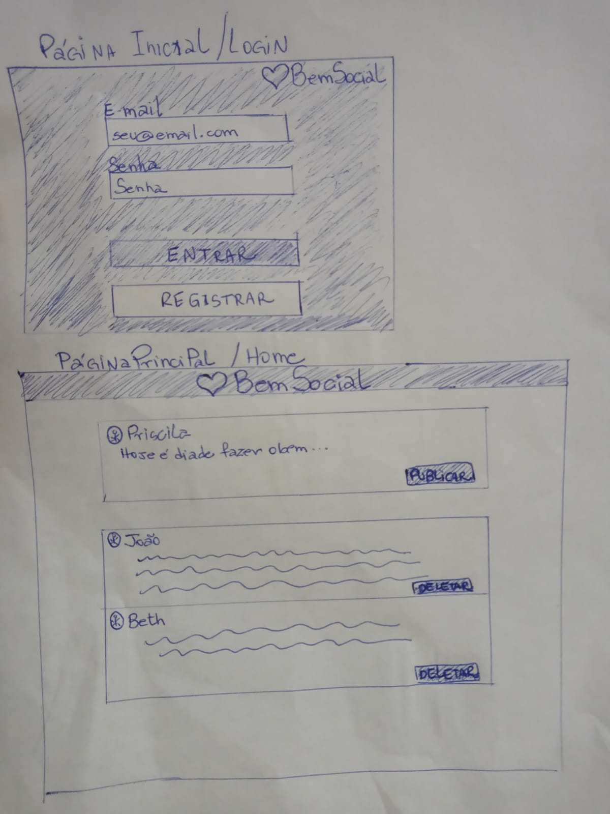
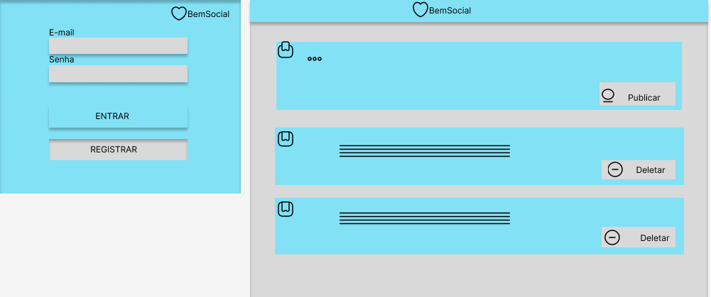

# BemSocial - Rede Social Simples

BemSocial é uma aplicação web que permite que os usuários criem postagens e compartilhem com outros usuários serviços sem o uso de dinheiro.

## Funcionalidades

- Registro de usuário com e-mail e senha.
- Login de usuário.
- Postagem de mensagens no feed.
- Exclusão de postagens (apenas pelo autor).
- Navegação entre as páginas de login e feed.

## Tecnologias Utilizadas

- HTML, CSS e JavaScript para a interface do usuário.
- Firebase para autenticação de usuário e armazenamento de postagens.

## Protótipo de Baixa Fidelidade

## Protótipo de Alta fidelidade

## Repositório

1. Clone este repositório em sua máquina local:

  git clone 
